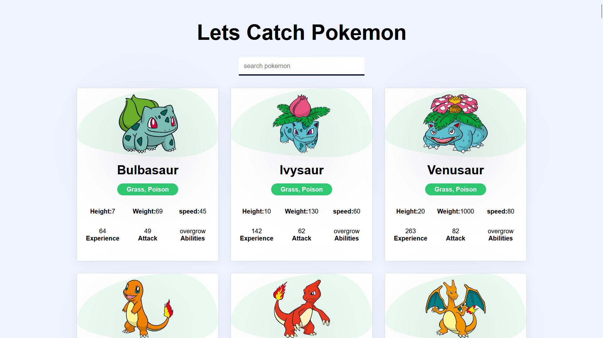
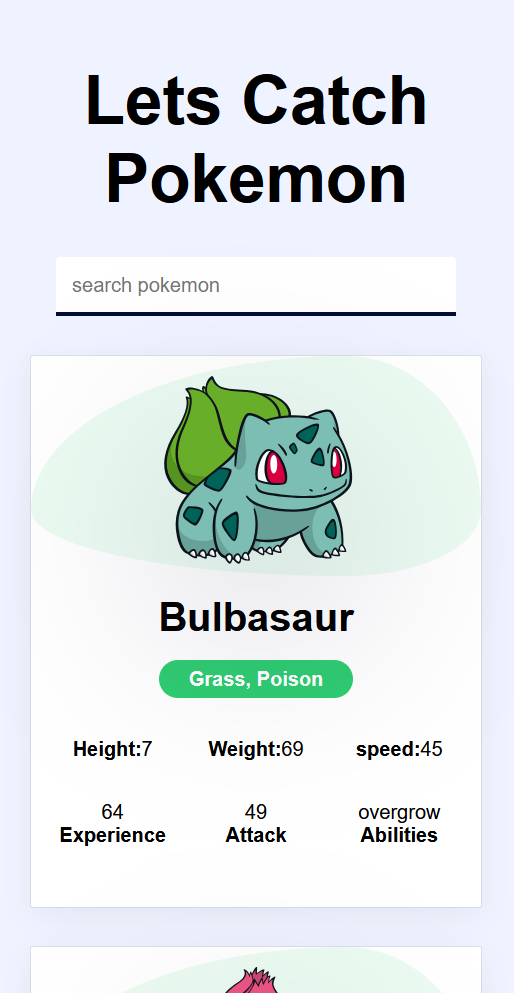

# Pokemon Search App

## Overview
The **Pokemon Search App** is a React-based web application that allows users to search and view details of Pokemon fetched from the [PokeAPI](https://pokeapi.co/). It provides information such as Pokemon name, type, height, weight, speed, attack, and abilities with an interactive UI.

## Features
- **Fetches and displays 124 Pokemon**: Data is retrieved from the PokeAPI dynamically.
- **Search Functionality**: Users can search for a Pokemon by typing its name in the input field.
- **Detailed Pokemon Information**: Each Pokemon card displays its image, type, height, weight, speed, attack, and abilities.
- **Responsive Design**: The application is styled using CSS to ensure a smooth user experience across devices.
- **Optimized Performance**: Uses React hooks and asynchronous functions to fetch and render data efficiently.

## Installation Guide
Follow these steps to set up the project locally:

1. **Clone the repository**:
   ```sh
   git clone https://github.com/your-username/your-repository.git
   ```
2. **Navigate to the project directory**:
   ```sh
   cd your-repository
   ```
3. **Install dependencies**:
   ```sh
   npm install
   ```
4. **Start the development server**:
   ```sh
   npm run dev
   ```

## Project Structure
```
├── src
│   ├── components
│   │   ├── Pokemon.jsx
│   │   ├── PokemonCard.jsx
│   ├── styles
│   │   ├── App.css
│   │   ├── index.css
│   ├── App.jsx
│   ├── main.jsx
├── package.json
├── README.md
└── vite.config.js
```

## Technologies Used
- **React.js**: Frontend framework for building the UI.
- **Vite**: Development environment for optimized performance.
- **PokeAPI**: External API to fetch Pokemon data.
- **CSS**: Custom styling for layout and design.

## How It Works
1. The `Pokemon.jsx` component fetches Pokemon data from PokeAPI and stores it in state.
2. The `PokemonCard.jsx` component renders individual Pokemon details in a styled card format.
3. Users can type into the search bar to filter Pokemon dynamically.
4. The app updates the displayed Pokemon list as the user types.

## Screenshots

# Desktop view :



# Mobile view :



## Future Enhancements
- Add pagination to display more Pokemon.
- Implement filtering by Pokemon type.
- Improve UI with animations and transitions.
- Add a favorites feature to save Pokemon.

## Contribution Guidelines
Contributions are welcome! If you'd like to contribute:
1. Fork this repository.
2. Create a new branch (`git checkout -b feature-branch`).
3. Commit your changes (`git commit -m 'Added new feature'`).
4. Push to the branch (`git push origin feature-branch`).
5. Create a pull request.

## License
This project is licensed under the MIT License.

---

Feel free to modify the content as per your project details!

